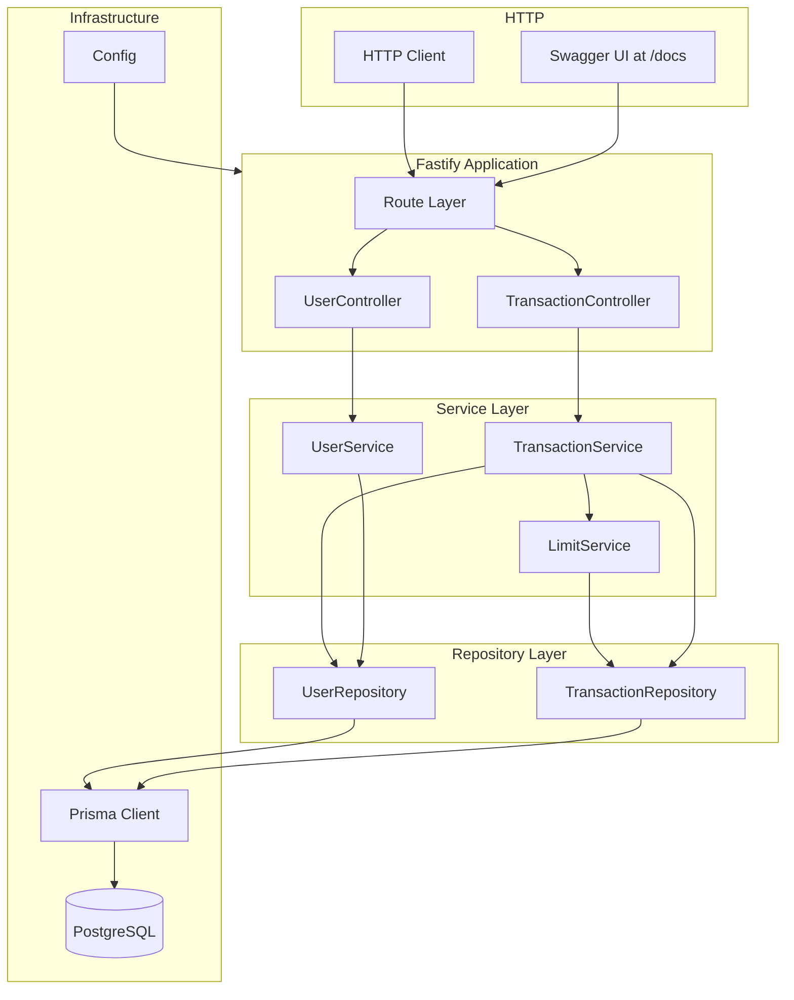
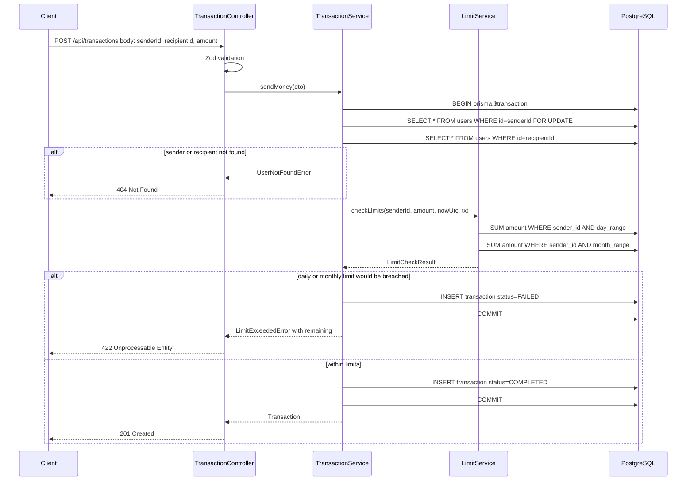
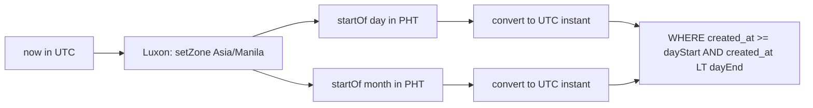
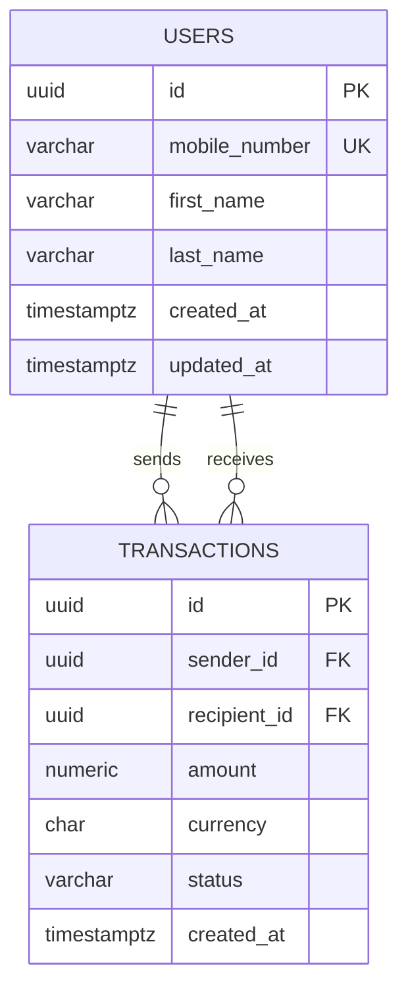

# Technical Design: Send Money Limits Module

---

## Overview

The Send Money Limits Module is a greenfield backend HTTP API service that enables registered users to transfer PHP currency to one another, subject to configurable daily (₱50,000) and monthly (₱500,000) spending caps per sender. Calendar period boundaries are defined in the Asia/Manila (PHT, UTC+8) timezone; all persisted timestamps are stored in UTC. The service is fully containerized, auto-documented via an interactive Swagger UI, and exercisable from seed data immediately after `docker compose up`.

**Purpose**: Deliver a production-boundary reference implementation of a fintech transaction limit engine demonstrating type-safe TypeScript, correct monetary arithmetic, race-condition-safe limit enforcement, and zero-configuration local setup.

**Users**: System operators create and look up users; end-users send money, inspect limit usage, and view transaction history through the REST API.

**Impact**: Establishes the entire service from scratch — no prior codebase to integrate with.

### Goals

- Enforce daily and monthly PHP spending limits with correct PHT timezone reset semantics.
- Prevent concurrent transactions from the same sender from bypassing limits through a row-level database lock.
- Serve an interactive OpenAPI 3.x UI from a single route with no manual documentation step.
- Start fully operational (schema migrated, seed data loaded) via `docker compose up` alone.

### Non-Goals

- External payouts or cross-system transfers.
- Balance tracking (no wallet/account balance — only spending limit enforcement).
- Asynchronous transaction settlement or pending states beyond `COMPLETED` / `FAILED`.
- Authentication or authorization (no auth layer in scope; all endpoints are open).
- Horizontal scaling, caching, or high-throughput optimization.

---

## Architecture

### Architecture Pattern & Boundary Map

Selected pattern: **Layered Architecture** (Router → Controller → Service → Repository → Database). Full rationale and alternatives in `research.md` § Architecture Pattern Evaluation.



**Key decisions**:
- `LimitService` is a pure domain service: it receives pre-computed PHT period boundaries (UTC instants) and runs aggregation queries via `TransactionRepository`. It owns no HTTP or persistence concerns.
- `TransactionService` orchestrates the entire send-money flow inside a single Prisma transaction, including the `SELECT ... FOR UPDATE` lock on the sender row.
- The Router layer is the only location that depends on Fastify types; Controllers receive plain DTOs.

### Technology Stack

| Layer | Choice / Version | Role | Notes |
|-------|-----------------|------|-------|
| Language | TypeScript 5.x | Type-safe implementation | `strict: true`; never use `any` |
| Runtime | Node.js 22 LTS | Application runtime | LTS, Docker image `node:22-alpine` |
| Framework | Fastify v5 | HTTP server, routing, schema validation | Built-in JSON Schema pipeline |
| Type Provider | fastify-type-provider-zod (official) | Zod ↔ Fastify type bridge | Avoid `.transform()` in response schemas; see `research.md` |
| API Docs | @fastify/swagger + @fastify/swagger-ui | OpenAPI 3.x spec + interactive UI at `/docs` | Auto-generated from route schema registrations |
| Validation | Zod v3 | Request schema validation and TS inference | Response shapes use plain Zod (no `.transform()`) |
| ORM | Prisma 7 | Database access, migrations, seed | Pure TS runtime (Prisma 7 dropped Rust engine) |
| Monetary arithmetic | `Prisma.Decimal` (via `@prisma/client`) | Exact decimal math for limit checks and comparisons | Already bundled with Prisma 7; no additional `decimal.js` dependency needed |
| Database | PostgreSQL 16 | Primary data store | TIMESTAMPTZ for all timestamps (UTC) |
| Timezone | Luxon | PHT boundary computation | `DateTime.now().setZone('Asia/Manila').startOf('day')` |
| Testing | Vitest | Unit + integration test runner | `@vitest/coverage-v8` for coverage |
| Container | Docker + Compose v2 | Containerized app + DB | Multi-stage Dockerfile, `docker compose up` starts everything |

---

## System Flows

### 1. Send Money — Happy Path and Limit Breach



> The `FOR UPDATE` on the sender row serializes concurrent requests from the same sender at the database level. The second concurrent transaction blocks until the first commits, then re-reads the now-updated aggregate — preventing both from independently passing the limit check. Crucially, `checkLimits` receives the `tx` client so that `sumByPeriod` runs on the same pooled connection; without this, an inner query on the default client would compete for a connection the outer transaction already holds, causing a deadlock.

### 2. PHT Period Boundary Computation



> Period boundaries are always computed in application code (Luxon) and passed to the database as UTC `Date` values. The database session timezone is never set.

---

## Requirements Traceability

| Requirement | Summary | Components | Key Interfaces | Flow |
|-------------|---------|------------|----------------|------|
| 1.1–1.4 | User identity, creation, conflict, lookup | UserController, UserService, UserRepository | `POST /api/users`, `GET /api/users/:id` | — |
| 2.1–2.8 | Send money validation, persistence | TransactionController, TransactionService, UserRepository, TransactionRepository | `POST /api/transactions`, TransactionService.sendMoney | Flow 1 |
| 3.1–3.10 | Daily/monthly limit enforcement, resets, timezone | TransactionService, LimitService, TransactionRepository | LimitService.checkLimits, TransactionRepository.sumByPeriod | Flow 1, Flow 2 |
| 4.1–4.5 | Limit usage inspection endpoint | TransactionController, LimitService, TransactionRepository | `GET /api/users/:id/limits` | Flow 2 |
| 5.1–5.6 | Transaction history with direction + pagination | TransactionController, TransactionService, TransactionRepository | `GET /api/users/:id/transactions` | — |
| 6.1–6.5 | RESTful API, OpenAPI 3.x, Swagger UI, error shapes | Router, @fastify/swagger, @fastify/swagger-ui, ErrorHandler | `GET /docs` | — |
| 7.1–7.6 | Docker Compose startup, .env.example, seed data, README | docker-compose.yml, Dockerfile, seed.ts, Config | — | — |
| 8.1–8.3 | Unit + integration tests for limit logic and transaction flow | Vitest test suite | — | — |

---

## Components and Interfaces

### Summary Table

| Component | Layer | Intent | Req Coverage | Key Dependencies | Contracts |
|-----------|-------|--------|--------------|-----------------|-----------|
| UserRouter | HTTP | Register user-related routes | 1.1–1.4, 5.1–5.6, 4.1–4.5 | Fastify, UserController, TransactionController | API |
| TransactionRouter | HTTP | Register transaction routes | 2.1–2.8 | Fastify, TransactionController | API |
| UserController | Controller | Map user HTTP requests to service calls | 1.1–1.4 | UserService | Service |
| TransactionController | Controller | Map transaction/limit/history requests to service calls | 2.1–2.8, 4.1–4.5, 5.1–5.6 | TransactionService, LimitService | Service |
| UserService | Service | User creation and lookup | 1.1–1.4 | UserRepository | Service |
| TransactionService | Service | Send money orchestration, lock, limit gate, persistence | 2.1–2.8, 3.1–3.10 | LimitService, UserRepository, TransactionRepository, Prisma | Service |
| LimitService | Service | PHT boundary computation, period SUM, limit decision | 3.1–3.10, 4.1–4.5 | TransactionRepository, Luxon | Service |
| UserRepository | Repository | User CRUD and existence checks | 1.1–1.4, 2.1–2.5 | Prisma | Service |
| TransactionRepository | Repository | Transaction insert, history query, period SUM | 2.7–2.8, 3.3–3.4, 5.1–5.6 | Prisma | Service |
| Config | Infra | Env-var loading with fail-fast validation | 7.3, 7.6 | Zod, process.env | Service |
| ErrorHandler | Infra | Normalise all Fastify errors to standard JSON shape | 6.4–6.5 | Fastify | — |

---

### HTTP Layer

#### UserRouter & TransactionRouter

| Field | Detail |
|-------|--------|
| Intent | Register all API routes with Zod request/response schemas; emit OpenAPI metadata |
| Requirements | 1.1–1.4, 2.1–2.8, 4.1–4.5, 5.1–5.6, 6.1–6.3 |

**Responsibilities & Constraints**
- Declare all routes with `schema: { body, params, querystring, response }` using Zod shapes so `@fastify/swagger` auto-generates the OpenAPI spec.
- Never contain business logic; delegate immediately to the corresponding Controller method.
- Response schemas must use plain Zod shapes (no `.transform()`) to maintain accurate OpenAPI output.

**Contracts**: API [x]

##### API Contract

| Method | Endpoint | Request Body / Params | Success Response | Error Codes |
|--------|----------|-----------------------|-----------------|-------------|
| GET | /api/users | — | 200 `UserResponse[]` | 500 |
| POST | /api/users | `CreateUserRequest` | 201 `UserResponse` | 409, 422, 500 |
| GET | /api/users/:userId | params: `userId` (UUID) | 200 `UserResponse` | 404, 500 |
| POST | /api/transactions | `CreateTransactionRequest` | 201 `TransactionResponse` | 404, 422, 500 |
| GET | /api/users/:userId/limits | params: `userId` (UUID) | 200 `LimitUsageResponse` | 404, 500 |
| GET | /api/users/:userId/transactions | params: `userId`, query: `page`, `pageSize` | 200 `TransactionHistoryResponse` | 404, 500 |
| GET | /docs | — | Swagger UI HTML | — |
| GET | /health | — | 200 `{ status: "ok" }` | — |

---

### Controller Layer

#### UserController

| Field | Detail |
|-------|--------|
| Intent | Parse user-related HTTP requests and delegate to UserService |
| Requirements | 1.1–1.4 |

**Contracts**: Service [x]

##### Service Interface

```typescript
interface UserControllerMethods {
  createUser(request: FastifyRequest<{ Body: CreateUserRequest }>): Promise<UserResponse>;
  getUserById(request: FastifyRequest<{ Params: UserParams }>): Promise<UserResponse>;
}
```

**Implementation Notes**
- Catches `DuplicateMobileNumberError` → reply 409; `UserNotFoundError` → reply 404.
- Never constructs domain objects; receives and returns plain DTOs.

---

#### TransactionController

| Field | Detail |
|-------|--------|
| Intent | Parse transaction, limit, and history HTTP requests; delegate to service layer |
| Requirements | 2.1–2.8, 4.1–4.5, 5.1–5.6 |

**Contracts**: Service [x]

##### Service Interface

```typescript
interface TransactionControllerMethods {
  sendMoney(request: FastifyRequest<{ Body: CreateTransactionRequest }>): Promise<TransactionResponse>;
  getLimitUsage(request: FastifyRequest<{ Params: UserParams }>): Promise<LimitUsageResponse>;
  getTransactionHistory(
    request: FastifyRequest<{ Params: UserParams; Querystring: PaginationQuery }>
  ): Promise<TransactionHistoryResponse>;
}
```

**Implementation Notes**
- Catches `UserNotFoundError` → 404; `LimitExceededError` → 422 with `remaining` and `limit` in `details`; `SelfTransferError` → 422.
- Injects current UTC time as `Date` into service calls; services receive it as a parameter (enables deterministic testing via time injection).

---

### Service Layer

#### UserService

| Field | Detail |
|-------|--------|
| Intent | Encapsulate user creation and retrieval business logic |
| Requirements | 1.1–1.4 |

**Dependencies**
- Outbound: `UserRepository` — persistence (P0)

**Contracts**: Service [x]

##### Service Interface

```typescript
interface UserService {
  createUser(dto: CreateUserDto): Promise<User>;
  getUserById(id: string): Promise<User>;
}

interface CreateUserDto {
  mobileNumber: string;
  firstName: string;
  lastName: string;
}

interface User {
  id: string;
  mobileNumber: string;
  firstName: string;
  lastName: string;
  createdAt: Date;
  updatedAt: Date;
}
```

- Preconditions: `mobileNumber` is non-empty; `id` is a valid UUID string.
- Postconditions: `createUser` returns persisted `User` or throws `DuplicateMobileNumberError`.
- Invariants: `id` is globally unique; `mobileNumber` is unique per system.

---

#### TransactionService

| Field | Detail |
|-------|--------|
| Intent | Orchestrate the send-money flow: validate parties, acquire sender lock, check limits, persist transaction |
| Requirements | 2.1–2.8, 3.1–3.10 |

**Dependencies**
- Outbound: `LimitService` — limit evaluation (P0)
- Outbound: `UserRepository` — sender/recipient existence (P0)
- Outbound: `TransactionRepository` — transaction insert (P0)
- External: `Prisma.$transaction` — atomic unit of work with `FOR UPDATE` (P0)

**Contracts**: Service [x]

##### Service Interface

```typescript
interface TransactionService {
  sendMoney(dto: CreateTransactionDto, now: Date): Promise<Transaction>;
  getTransactionHistory(userId: string, pagination: PaginationOptions): Promise<PaginatedResult<TransactionHistoryItem>>;
}

interface CreateTransactionDto {
  senderId: string;
  recipientId: string;
  amount: string; // decimal string, e.g. "1500.00"
}

interface Transaction {
  id: string;
  senderId: string;
  recipientId: string;
  amount: string;
  currency: 'PHP';
  status: TransactionStatus;
  createdAt: Date;
}

type TransactionStatus = 'COMPLETED' | 'FAILED';

interface PaginationOptions {
  page: number;       // 1-based
  pageSize: number;   // default 20, max 100
}

interface PaginatedResult<T> {
  data: T[];
  pagination: {
    page: number;
    pageSize: number;
    total: number;
    totalPages: number;
  };
}

interface TransactionHistoryItem {
  id: string;
  counterpartId: string;
  direction: 'SENT' | 'RECEIVED';
  amount: string;
  currency: 'PHP';
  status: TransactionStatus;
  createdAt: Date;
}
```

- Preconditions: `senderId !== recipientId`; `amount` parses to a positive decimal with ≤2 decimal places; `now` is a valid UTC `Date`.
- Postconditions: On success, exactly one `COMPLETED` transaction row exists; limits are not exceeded. On limit breach, exactly one `FAILED` transaction row exists for audit.
- Invariants: The entire flow (lock → limit check → insert) executes within a single Prisma transaction.

**Implementation Notes**
- Integration: `prisma.$transaction(async (tx) => { await tx.$queryRaw\`SELECT id FROM users WHERE id = ${senderId} FOR UPDATE\`; await limitService.checkLimits(senderId, amount, now, tx); ... })`. The `tx` client is passed to `checkLimits` and forwarded to `sumByPeriod`, ensuring all queries within the atomic block share the same connection and avoid connection pool exhaustion.
- Validation: `amount` is accepted as a `string` in the request body and validated at the Zod layer with regex `/^\d+(\.\d{1,2})?$/` plus a positive-value check. The service receives the validated string directly — no number-to-string conversion at the controller layer. This avoids IEEE 754 float precision failures (e.g., `1500.10 * 100 ≠ 150010` in JavaScript).
- Risks: `FOR UPDATE` creates a bottleneck per sender under high concurrency — documented in README as a production revisit item.

---

#### LimitService

| Field | Detail |
|-------|--------|
| Intent | Compute PHT period boundaries, aggregate sender spend, and return a typed limit-check result |
| Requirements | 3.1–3.10, 4.1–4.5 |

**Dependencies**
- Outbound: `TransactionRepository.sumByPeriod` — aggregation query (P0)
- External: `Luxon` — timezone-aware period boundary calculation (P0)

**Contracts**: Service [x]

##### Service Interface

```typescript
const DAILY_LIMIT = 50_000;
const MONTHLY_LIMIT = 500_000;

interface LimitService {
  checkLimits(senderId: string, amount: string, now: Date, tx?: PrismaTransactionClient): Promise<LimitCheckResult>;
  getLimitUsage(userId: string, now: Date): Promise<LimitUsage>;
}

type LimitCheckResult =
  | { allowed: true }
  | { allowed: false; reason: LimitBreachReason; remaining: string; limit: number };

type LimitBreachReason = 'DAILY_LIMIT_EXCEEDED' | 'MONTHLY_LIMIT_EXCEEDED';

interface LimitUsage {
  userId: string;
  asOf: Date;
  timezone: 'Asia/Manila';
  daily: PeriodUsage;
  monthly: PeriodUsage;
}

interface PeriodUsage {
  limit: number;
  spent: string;
  remaining: string;
  resetsAt: Date; // UTC instant of next period start in PHT
}

interface PeriodBoundary {
  start: Date; // UTC
  end: Date;   // UTC (exclusive)
}
```

- Preconditions: `now` is a valid UTC `Date`; `amount` is a non-negative decimal string.
- Postconditions: `checkLimits` evaluates daily breach first; if daily passes, evaluates monthly. Returns first breach found.
- Invariants: A transaction is allowed only when `spent + amount <= limit` for both periods (inclusive boundary per spec).

**Implementation Notes**
- Boundary computation: `DateTime.fromJSDate(now).setZone('Asia/Manila').startOf('day').toUTC().toJSDate()` for daily start.
- `sumByPeriod` returns `'0.00'` (string) when no transactions exist in range.
- All arithmetic uses `Prisma.Decimal` from `@prisma/client` to avoid float errors: `new Prisma.Decimal(spent).plus(amount).lte(limit)`. No additional `decimal.js` import needed.
- The `tx` parameter (when provided) is forwarded to `TransactionRepository.sumByPeriod`, ensuring limit aggregation queries run on the same database connection as the enclosing `prisma.$transaction` — preventing connection pool exhaustion under concurrent load.

---

### Repository Layer

#### UserRepository

| Field | Detail |
|-------|--------|
| Intent | Thin Prisma wrapper for user persistence |
| Requirements | 1.1–1.4, 2.1–2.5 |

**Dependencies**
- External: `PrismaClient` (P0)

**Contracts**: Service [x]

##### Service Interface

```typescript
interface UserRepository {
  create(data: CreateUserDto): Promise<User>;
  findById(id: string): Promise<User | null>;
  findByMobileNumber(mobileNumber: string): Promise<User | null>;
}
```

- Throws `DuplicateMobileNumberError` when Prisma unique constraint violation occurs (`P2002`).

---

#### TransactionRepository

| Field | Detail |
|-------|--------|
| Intent | Transaction insert, period-sum aggregation, and history queries |
| Requirements | 2.7–2.8, 3.3–3.4, 5.1–5.6 |

**Dependencies**
- External: `PrismaClient` (P0)

**Contracts**: Service [x]

##### Service Interface

```typescript
interface TransactionRepository {
  create(data: CreateTransactionData, tx?: PrismaTransactionClient): Promise<Transaction>;
  sumByPeriod(senderId: string, period: PeriodBoundary, tx?: PrismaTransactionClient): Promise<string>;
  findByUserId(userId: string, options: PaginationOptions): Promise<PaginatedResult<Transaction>>;
}

interface CreateTransactionData {
  senderId: string;
  recipientId: string;
  amount: string;
  currency: 'PHP';
  status: TransactionStatus;
}
```

- `sumByPeriod`: executes `SELECT COALESCE(SUM(amount), 0) FROM transactions WHERE sender_id = $1 AND status = 'COMPLETED' AND created_at >= $2 AND created_at < $3`.
- `findByUserId`: returns transactions where `sender_id = userId OR recipient_id = userId`, ordered by `created_at DESC`, with `skip`/`take` pagination via Prisma.
- The optional `tx` parameter accepts a Prisma interactive-transaction client for use within `TransactionService`'s atomic block.

---

### Infrastructure

#### Config

| Field | Detail |
|-------|--------|
| Intent | Load and validate all environment variables at startup; fail fast if any are missing |
| Requirements | 7.3, 7.6 |

**Contracts**: Service [x]

##### Service Interface

```typescript
interface AppConfig {
  port: number;
  databaseUrl: string;
  nodeEnv: 'development' | 'test' | 'production';
  logLevel: 'debug' | 'info' | 'warn' | 'error';
}

function loadConfig(): AppConfig; // throws ConfigError with missing variable name if validation fails
```

- Uses Zod to parse `process.env` at module load time.
- Called once at `main()` entry point before the Fastify server is created.

---

#### ErrorHandler

| Field | Detail |
|-------|--------|
| Intent | Normalise all thrown errors and Fastify validation failures to a standard JSON error envelope |
| Requirements | 6.4–6.5 |

**Implementation Notes**
- Set as Fastify's `setErrorHandler`. Maps domain error classes to HTTP status codes:
  - `UserNotFoundError` → 404
  - `DuplicateMobileNumberError` → 409
  - `SelfTransferError` | `LimitExceededError` | `InvalidAmountError` → 422
  - `ConfigError` → 500 (startup only)
  - Unrecognised → 500

- Standard error envelope:
```typescript
interface ErrorEnvelope {
  statusCode: number;
  error: string;    // machine-readable code e.g. "LIMIT_EXCEEDED_DAILY"
  message: string;  // human-readable description
  details?: Record<string, unknown>; // e.g. { remaining: "2500.00", limit: 50000 }
}
```

---

## Data Models

### Domain Model

```
User (Aggregate Root)
  - id: UUID
  - mobileNumber: string (unique natural key)
  - firstName, lastName: string
  Invariant: mobileNumber unique system-wide

Transaction (Aggregate Root)
  - id: UUID
  - senderId → User
  - recipientId → User
  Invariant: senderId ≠ recipientId
  - amount: Decimal (> 0, ≤2dp)
  - currency: 'PHP'
  - status: 'COMPLETED' | 'FAILED'
  Invariant: FAILED transactions are not included in limit aggregations
  - createdAt: TIMESTAMPTZ (UTC)
```

### Logical Data Model



**Consistency & Integrity**:
- `sender_id` and `recipient_id` are non-nullable foreign keys to `users.id`.
- No cascade deletes: users are immutable records in this service.
- `created_at` is set by the database (`DEFAULT NOW()`) in UTC; application never writes this field directly.
- Transaction boundaries: all send-money writes (including the `FOR UPDATE` lock) happen within a single `prisma.$transaction()` call.

### Physical Data Model (PostgreSQL)

```sql
CREATE TABLE users (
  id           UUID          PRIMARY KEY DEFAULT gen_random_uuid(),
  mobile_number VARCHAR(20)  UNIQUE NOT NULL,
  first_name   VARCHAR(100)  NOT NULL,
  last_name    VARCHAR(100)  NOT NULL,
  created_at   TIMESTAMPTZ   NOT NULL DEFAULT NOW(),
  updated_at   TIMESTAMPTZ   NOT NULL DEFAULT NOW()
);

CREATE TABLE transactions (
  id           UUID           PRIMARY KEY DEFAULT gen_random_uuid(),
  sender_id    UUID           NOT NULL REFERENCES users(id),
  recipient_id UUID           NOT NULL REFERENCES users(id),
  amount       NUMERIC(15,2)  NOT NULL CHECK (amount > 0),
  currency     CHAR(3)        NOT NULL DEFAULT 'PHP',
  status       VARCHAR(20)    NOT NULL DEFAULT 'COMPLETED',
  created_at   TIMESTAMPTZ    NOT NULL DEFAULT NOW()
);

-- Supports limit aggregation queries (sender_id + date range filter)
CREATE INDEX idx_tx_sender_created ON transactions (sender_id, created_at DESC);

-- Supports transaction history queries (recipient side)
CREATE INDEX idx_tx_recipient_created ON transactions (recipient_id, created_at DESC);
```

> Managed by Prisma Migrate (`prisma/schema.prisma`). The seed script (`prisma/seed.ts`) runs via `prisma db seed` as part of the Docker entrypoint.

### Data Contracts & Integration

**Request/Response Schemas**

```typescript
// POST /api/users
interface CreateUserRequest {
  mobileNumber: string;  // e.g. "+639171234567"
  firstName: string;
  lastName: string;
}
interface UserResponse {
  id: string;
  mobileNumber: string;
  firstName: string;
  lastName: string;
  createdAt: string; // ISO 8601 UTC
}

// POST /api/transactions
interface CreateTransactionRequest {
  senderId: string;    // UUID
  recipientId: string; // UUID
  amount: string;      // decimal string e.g. "1500.00"; validated by Zod regex /^\d+(\.\d{1,2})?$/ and must be > 0
}
interface TransactionResponse {
  id: string;
  senderId: string;
  recipientId: string;
  amount: string;   // decimal string e.g. "1500.00"
  currency: 'PHP';
  status: 'COMPLETED' | 'FAILED';
  createdAt: string;
}

// GET /api/users/:userId/limits
interface LimitUsageResponse {
  userId: string;
  asOf: string;
  timezone: 'Asia/Manila';
  daily: {
    limit: number;
    spent: string;
    remaining: string;
    resetsAt: string;
  };
  monthly: {
    limit: number;
    spent: string;
    remaining: string;
    resetsAt: string;
  };
}

// GET /api/users/:userId/transactions
interface TransactionHistoryResponse {
  data: TransactionHistoryItem[];
  pagination: {
    page: number;
    pageSize: number;
    total: number;
    totalPages: number;
  };
}
interface TransactionHistoryItem {
  id: string;
  counterpartId: string;
  direction: 'SENT' | 'RECEIVED';
  amount: string;
  currency: 'PHP';
  status: 'COMPLETED' | 'FAILED';
  createdAt: string;
}
```

> `amount` is returned as a decimal `string` in all responses. Consumers must parse to their native decimal type. See `research.md` § Amount Representation for rationale.

---

## Error Handling

### Error Strategy

All errors flow through Fastify's `setErrorHandler` which maps domain error types to HTTP status codes and the standard `ErrorEnvelope` shape. Fastify schema validation failures (Zod) are also caught and normalised.

### Error Categories and Responses

| Category | Domain Error Class | HTTP Code | `error` Code | `details` |
|----------|--------------------|-----------|-------------|-----------|
| User input — not found | `UserNotFoundError` | 404 | `USER_NOT_FOUND` | `{ userId }` |
| User input — conflict | `DuplicateMobileNumberError` | 409 | `DUPLICATE_MOBILE_NUMBER` | — |
| Business logic | `SelfTransferError` | 422 | `SELF_TRANSFER_NOT_ALLOWED` | — |
| Business logic | `LimitExceededError` | 422 | `DAILY_LIMIT_EXCEEDED` or `MONTHLY_LIMIT_EXCEEDED` | `{ remaining, limit }` |
| Validation | Zod schema failure | 422 | `VALIDATION_ERROR` | `{ fields: [...] }` |
| Server | Unhandled / Prisma | 500 | `INTERNAL_SERVER_ERROR` | — |

### Monitoring

- Fastify's built-in `pino` logger at `info` level in production; `debug` in development.
- Log every incoming request (method, path, statusCode, latency).
- Log `error` level with full stack trace for 5xx responses.
- `GET /health` endpoint returns `{ status: "ok", timestamp: "..." }` for Docker health checks.

---

## Testing Strategy

### Unit Tests (Vitest)

Cover pure business logic in isolation — no database, no HTTP.

1. `LimitService.checkLimits` — daily cap at exactly ₱50,000 (allowed), ₱50,000.01 (blocked).
2. `LimitService.checkLimits` — monthly cap at exactly ₱500,000 (allowed), ₱500,000.01 (blocked).
3. `LimitService` — PHT day boundary: transaction at 23:59:59 PHT counts in current day; 00:00:00 PHT counts in next day.
4. `LimitService` — PHT month boundary: transaction on last second of month counts in current month; first second of next month starts fresh.
5. `LimitService.checkLimits` — daily breach reported before monthly breach when both would apply.
6. `TransactionService.sendMoney` — `SelfTransferError` thrown when `senderId === recipientId`.
7. Amount validation via Zod schema — rejects `"0"`, negative values (`"-1.00"`), values with >2 decimal places (`"1500.001"`), and non-numeric strings (`"abc"`); accepts `"1500.10"`, `"50000.00"`.

### Integration Tests (Vitest + real PostgreSQL)

Spin up a test PostgreSQL instance (Docker Compose test profile or `@testcontainers/postgresql`) and exercise end-to-end flows through the HTTP layer.

1. `POST /api/transactions` happy path — returns 201 with correct fields.
2. `POST /api/transactions` — sender at daily limit returns 422 `DAILY_LIMIT_EXCEEDED` with correct `remaining`.
3. `POST /api/transactions` — sender at monthly limit returns 422 `MONTHLY_LIMIT_EXCEEDED`.
4. `POST /api/transactions` — unknown sender returns 404.
5. `POST /api/transactions` — unknown recipient returns 404.
6. `GET /api/users/:id/limits` — returns correct `spent` and `remaining` after a transaction.
7. `GET /api/users/:id/transactions` — returns both sent and received transactions with correct `direction`.
8. `GET /api/users/:id/transactions` — pagination metadata is correct when total > pageSize.

---

## Security Considerations

- No authentication layer in scope (assessment constraint). README documents this explicitly as a production revisit item.
- All SQL access is via Prisma ORM parameterised queries; `$queryRaw` uses `Prisma.sql` tagged template to prevent injection.
- Sensitive config (`DATABASE_URL`) is loaded from environment variables only; never hardcoded or logged.
- `mobile_number` is treated as PII: not exposed in URL path parameters (UUID used instead); present only in user profile response.

## Performance & Scalability

- Composite indexes `(sender_id, created_at DESC)` and `(recipient_id, created_at DESC)` make limit aggregation and history queries O(log n + matching rows).
- `FOR UPDATE` row lock is the primary throughput bottleneck per sender. At assessment scale this is immaterial. Production revisit: materialised counter with optimistic concurrency or Redis atomic increment.
- Connection pooling: Prisma's built-in connection pool (`connection_limit` configurable via `DATABASE_URL`).

---

## Supporting References

See `research.md` for:
- Full framework and ORM selection rationale with alternatives.
- Concurrency race-condition analysis and PostgreSQL locking strategy.
- Timezone library comparison (Luxon vs date-fns-tz).
- Amount representation decision (NUMERIC vs integer centavos).
- Known `fastify-type-provider-zod` limitation with `.transform()`.
